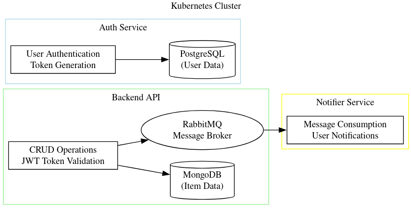

# Project Overview

## Distributed Architecture and Kubernetes/Microservices

This project is designed as a distributed e-commerce application that leverages Kubernetes (k8s) to orchestrate and manage a collection of microservices. Each microservice runs in its own container, allowing for independent scaling, deployment, and management. Kubernetes provides the necessary tools to automate deployment, scaling, and operations of these application containers across clusters of hosts.

The application is composed of three main services:

1. **Auth Service**: Manages user authentication and securely stores user credentials.
2. **Backend API**: Handles CRUD operations for items and interacts with the Auth and Notifier services.
3. **Notifier Service**: Sends notifications to users, such as email alerts for various triggers.

## Auth Service

The Auth Service is responsible for user registration, sign-in, and token validation. It securely stores user credentials using bcrypt for password hashing, which adds a layer of security against brute-force attacks. The service generates JWT tokens upon user sign-in, which are then used to authenticate API requests.

## Backend API

The Backend API is the core of the application, providing endpoints for item management such as adding, updating, retrieving, and deleting items. It uses JWT tokens for securing endpoints, ensuring that only authenticated users can access protected resources. The API interacts with MongoDB for data persistence and RabbitMQ for messaging with the Notifier service.

Some of the key endpoints include:

- `POST /item`: Add a new item.
- `GET /item/{id}`: Retrieve a specific item by its ID.
- `PUT /item/{id}`: Update an item by its ID.
- `DELETE /item/{id}`: Remove an item by its ID.
- `POST /buy/{id}`: Buy an item by its ID.

There are more endpoints. But openapi.yaml file describes the API in detail.

## Notifier Service

The Notifier Service listens for messages on RabbitMQ queues that are published by the Backend API. When certain actions are performed, such as adding or buying an item, the Backend API publishes a message to RabbitMQ, which the Notifier Service consumes and processes to send notifications to users.

## Communication Through RabbitMQ

The Backend and Notifier services communicate asynchronously through RabbitMQ. This message broker allows the services to work independently and ensures that notifications are sent even if the Notifier Service is temporarily unavailable. The use of RabbitMQ decouples the services, allowing for a more resilient and scalable system.

## Kubernetes Manifests

Each service has its own set of Kubernetes manifests that define how it should be deployed and managed within the Kubernetes cluster. These manifests include configurations for Deployments, Services, ConfigMaps, and other necessary Kubernetes resources.

By utilizing Kubernetes and a microservices architecture, the application is able to achieve high availability, scalability, and resilience.

## Integration Tests

The project includes a suite of integration tests that simulate user interactions with the API to ensure that all components of the system work together as expected. These tests cover scenarios such as user registration, item management, and purchasing processes. They are crucial for verifying the end-to-end functionality of the application.

## OpenAPI v3 Compliance

The API is compliant with the OpenAPI Specification version 3, which is an industry-standard for defining RESTful APIs. An `openapi.yaml` file is included in the project, which documents all the API endpoints, their parameters, request/response schemas, and security requirements. This specification ensures that the API is discoverable and understandable by both humans and machines, facilitating easier integration and usage.

## Database Usage

The Backend API service uses MongoDB, a NoSQL database, for storing and managing item data. MongoDB's flexible schema and scalability make it an excellent choice for handling the dynamic data requirements of e-commerce applications.

The Auth service uses PostgreSQL, a relational database, to securely store user credentials and manage authentication processes. PostgreSQL's robustness and support for complex queries ensure the integrity and security of user data.

## Helm Charts

The project also utilizes Helm, a package manager for Kubernetes, to streamline the deployment of services and their dependencies. Helm charts are used to define, install, and upgrade even the most complex Kubernetes applications. Which simplifies the management of application deployments and configurations.

## EFK Stack

The EFK (Elasticsearch, Fluentd, Kibana) stack was previously used for logging purposes. If you look under helms-manifests folder there are some helms for fluentd and elastic-search. However, due to the low volume of logs generated by the application, the decision was made to discontinue its use. The current logging setup is more lightweight and appropriate for the application's needs, while still providing sufficient insight into the system's behavior for debugging and monitoring purposes.
