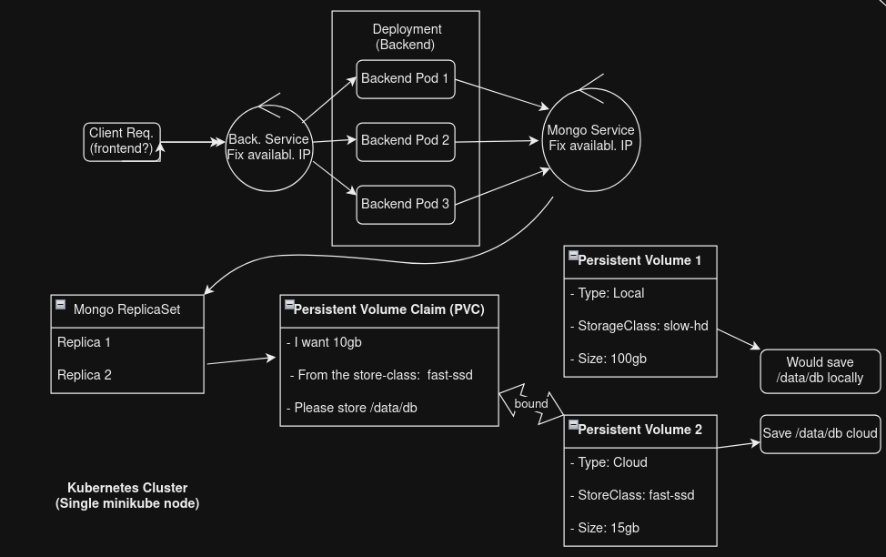
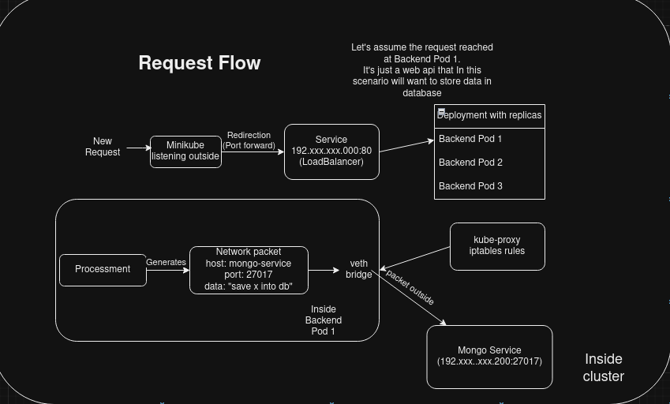

### LittleEcom
CRUD operations on Items 

### How it works
It's microservices based. Here's a picture explaining overall architecture


### Request flow


### About dumper.sh
It will continually get logs from every deployment from every pod, dumping each
deployment log in a different file. This is just a workaround, so I can debug
without having to rely on complex logging tools.

### Ensure mongo data replication
```
rs.initiate({
  _id: "rs0",
  members: [
    { _id: 0, host: "mongo-statefulset-0.mongo-service:27017" },
    { _id: 1, host: "mongo-statefulset-1.mongo-service:27017" },
    { _id: 2, host: "mongo-statefulset-2.mongo-service:27017" }
  ]
})
```
