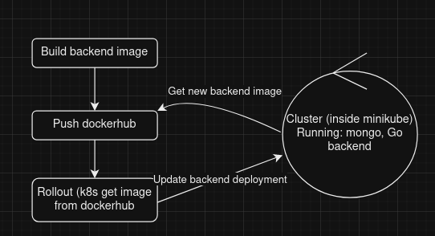

## Deploy
This is the backend of the application. It defines a set of CRUD operations to handle items and 
store into the database. Internally, these files will be running on minikube vm as an image.
This image is updated through a script which just build these files into an image and publish on
dockerhub.

There's another way to update the cluster. As we're running it locally, we could have set up
a way of copying these files into minikube then build from its inner docker runtime. However, it's 
way more work than just publishing on dockerhub and let k8s do the job

## 