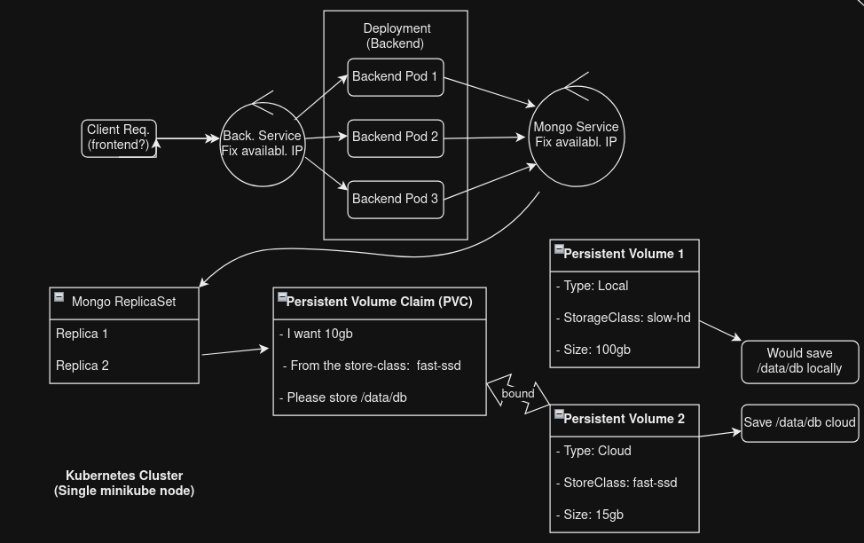
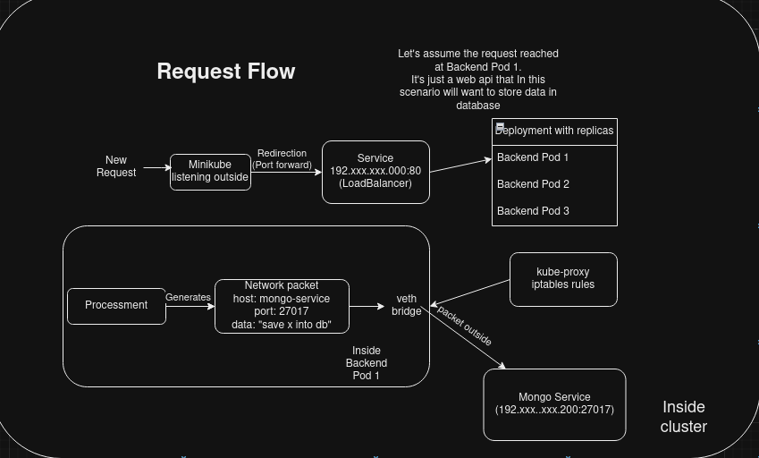

## Old things: not used anymore
Old efk stack was handled through k8s manifest, now its just helm; 

## Logs
older logs were emitted through a dumper who could get these logs without efk

## Tcp middleware
I was trying to set middleware in each pod who could catch tcp packets, with the purpose of logs and in-transit packet operation. 
But it was very heavy and sometimes the redirection to the real expected container did not work properly 
### LittleEcom
CRUD operations on Items

### How it works
It's microservices based. Here's a picture explaining overall architecture


### Request flow


### About dumper.sh
It will continually get logs from every deployment from every pod, dumping each
deployment log in a different file. This is just a workaround, so I can debug
without having to rely on complex logging tools.

### Ensure mongo data replication
```
rs.initiate({
  _id: "rs0",
  members: [
    { _id: 0, host: "mongo-statefulset-0.mongo-service:27017" },
    { _id: 1, host: "mongo-statefulset-1.mongo-service:27017" },
    { _id: 2, host: "mongo-statefulset-2.mongo-service:27017" }
  ]
})
```
